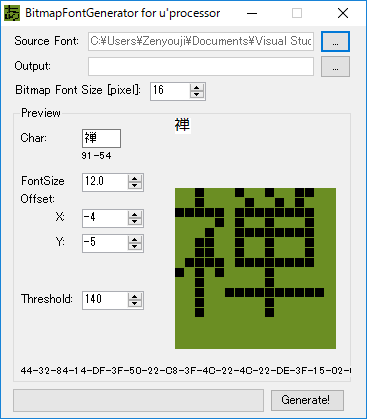
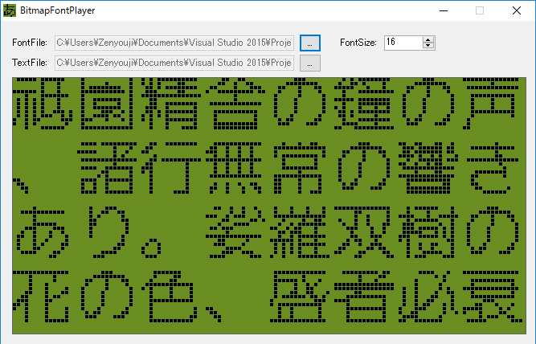

# Bitmap Font Generator for LCD

##Whats?
This is bitmap font converter from TTF fonts.
Generated font data is used small U'Processor and LCD screen.

Usually, We call this generated data FontROM or Kanji-ROM(漢字ROM).

##Generator (FontROM)

This sample uses "mplus-1c-regular.ttf".

##Player (FontROM checking tool)

##Design Environment
*C# VisualStudio2015

